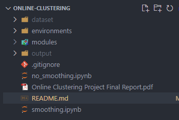

To run the code:

1. download the dataset and place it in the root directory. Your root directory should look like the following:
   
2. cd into the codebase root
3. if you are on a windows machine, run `conda env create --file=environments\environment-windows.yaml -n online-clustering-env`
4. if you are on macOS, run `conda env create --file=environments\environment-macos.yaml -n online-clustering-env`
5. In the smoothing.ipynb file, select online-clustering-env as your kernel, and run the file.
   - The output in cell with the markdown title “Optimal Clustering Results for No PCA"
6. Do the same for no_smoothing.ipynb.
   - The output cell with the markdown title “Optimal Clustering Results for PCA” is the most optimal results for PCA
